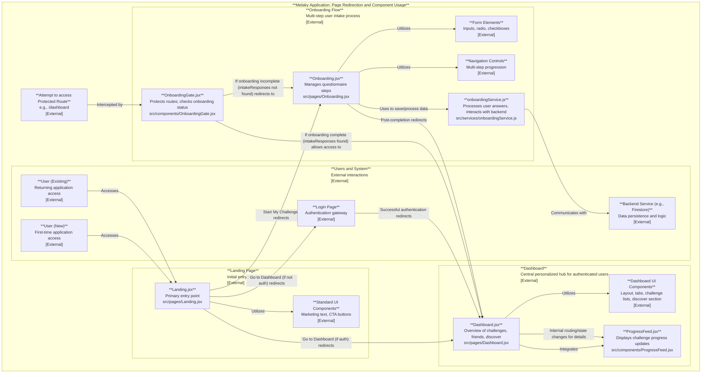

# Unnamed CodeViz Diagram

```mermaid
graph TD

    subgraph 843b3510-b79ae507-melakyApp["**Melaky Application: Page Redirection and Component Usage**<br>[External]"]
        843b3510-b79ae507-attemptProtected["**Attempt to access Protected Route**<br>e.g., /dashboard<br>[External]"]
        subgraph 843b3510-b79ae507-dashboardSection["**Dashboard**<br>Central personalized hub for authenticated users<br>[External]"]
            843b3510-b79ae507-cProgressFeed["**ProgressFeed.jsx**<br>Displays challenge progress updates<br>src/components/ProgressFeed.jsx"]
            843b3510-b79ae507-pDashboard["**Dashboard.jsx**<br>Overview of challenges, friends, discover<br>src/pages/Dashboard.jsx"]
            843b3510-b79ae507-uiDashboardLayout["**Dashboard UI Components**<br>Layout, tabs, challenge lists, discover section<br>[External]"]
            %% Edges at this level (grouped by source)
            843b3510-b79ae507-pDashboard["**Dashboard.jsx**<br>Overview of challenges, friends, discover<br>src/pages/Dashboard.jsx"] -->|"Utilizes"| 843b3510-b79ae507-uiDashboardLayout["**Dashboard UI Components**<br>Layout, tabs, challenge lists, discover section<br>[External]"]
            843b3510-b79ae507-pDashboard["**Dashboard.jsx**<br>Overview of challenges, friends, discover<br>src/pages/Dashboard.jsx"] -->|"Integrates"| 843b3510-b79ae507-cProgressFeed["**ProgressFeed.jsx**<br>Displays challenge progress updates<br>src/components/ProgressFeed.jsx"]
            843b3510-b79ae507-pDashboard["**Dashboard.jsx**<br>Overview of challenges, friends, discover<br>src/pages/Dashboard.jsx"] -->|"Internal routing/state changes for details"| 843b3510-b79ae507-cProgressFeed["**ProgressFeed.jsx**<br>Displays challenge progress updates<br>src/components/ProgressFeed.jsx"]
        end
        subgraph 843b3510-b79ae507-landingPage["**Landing Page**<br>Initial entry point for users<br>[External]"]
            843b3510-b79ae507-pLanding["**Landing.jsx**<br>Primary entry point<br>src/pages/Landing.jsx"]
            843b3510-b79ae507-uiLandingGeneric["**Standard UI Components**<br>Marketing text, CTA buttons<br>[External]"]
            %% Edges at this level (grouped by source)
            843b3510-b79ae507-pLanding["**Landing.jsx**<br>Primary entry point<br>src/pages/Landing.jsx"] -->|"Utilizes"| 843b3510-b79ae507-uiLandingGeneric["**Standard UI Components**<br>Marketing text, CTA buttons<br>[External]"]
        end
        subgraph 843b3510-b79ae507-onboardingFlow["**Onboarding Flow**<br>Multi-step user intake process<br>[External]"]
            843b3510-b79ae507-cOnboardingGate["**OnboardingGate.jsx**<br>Protects routes; checks onboarding status<br>src/components/OnboardingGate.jsx"]
            843b3510-b79ae507-pOnboarding["**Onboarding.jsx**<br>Manages questionnaire steps<br>src/pages/Onboarding.jsx"]
            843b3510-b79ae507-sOnboardingService["**onboardingService.js**<br>Processes user answers, interacts with backend<br>src/services/onboardingService.js"]
            843b3510-b79ae507-uiOnboardingForms["**Form Elements**<br>Inputs, radio, checkboxes<br>[External]"]
            843b3510-b79ae507-uiOnboardingNav["**Navigation Controls**<br>Multi-step progression<br>[External]"]
            %% Edges at this level (grouped by source)
            843b3510-b79ae507-pOnboarding["**Onboarding.jsx**<br>Manages questionnaire steps<br>src/pages/Onboarding.jsx"] -->|"Utilizes"| 843b3510-b79ae507-uiOnboardingForms["**Form Elements**<br>Inputs, radio, checkboxes<br>[External]"]
            843b3510-b79ae507-pOnboarding["**Onboarding.jsx**<br>Manages questionnaire steps<br>src/pages/Onboarding.jsx"] -->|"Utilizes"| 843b3510-b79ae507-uiOnboardingNav["**Navigation Controls**<br>Multi-step progression<br>[External]"]
            843b3510-b79ae507-pOnboarding["**Onboarding.jsx**<br>Manages questionnaire steps<br>src/pages/Onboarding.jsx"] -->|"Uses to save/process data"| 843b3510-b79ae507-sOnboardingService["**onboardingService.js**<br>Processes user answers, interacts with backend<br>src/services/onboardingService.js"]
            843b3510-b79ae507-cOnboardingGate["**OnboardingGate.jsx**<br>Protects routes; checks onboarding status<br>src/components/OnboardingGate.jsx"] -->|"If onboarding incomplete (intakeResponses not found) redirects to"| 843b3510-b79ae507-pOnboarding["**Onboarding.jsx**<br>Manages questionnaire steps<br>src/pages/Onboarding.jsx"]
        end
        subgraph 843b3510-b79ae507-usersSystem["**Users and System**<br>External interactions<br>[External]"]
            843b3510-b79ae507-sBackendService["**Backend Service (e.g., Firestore)**<br>Data persistence and logic<br>[External]"]
            843b3510-b79ae507-uExistingUser["**User (Existing)**<br>Returning application access<br>[External]"]
            843b3510-b79ae507-uLoginPage["**Login Page**<br>Authentication gateway<br>[External]"]
            843b3510-b79ae507-uNewUser["**User (New)**<br>First-time application access<br>[External]"]
        end
        %% Edges at this level (grouped by source)
        843b3510-b79ae507-uNewUser["**User (New)**<br>First-time application access<br>[External]"] -->|"Accesses"| 843b3510-b79ae507-pLanding["**Landing.jsx**<br>Primary entry point<br>src/pages/Landing.jsx"]
        843b3510-b79ae507-uExistingUser["**User (Existing)**<br>Returning application access<br>[External]"] -->|"Accesses"| 843b3510-b79ae507-pLanding["**Landing.jsx**<br>Primary entry point<br>src/pages/Landing.jsx"]
        843b3510-b79ae507-pLanding["**Landing.jsx**<br>Primary entry point<br>src/pages/Landing.jsx"] -->|"Start My Challenge redirects"| 843b3510-b79ae507-pOnboarding["**Onboarding.jsx**<br>Manages questionnaire steps<br>src/pages/Onboarding.jsx"]
        843b3510-b79ae507-pLanding["**Landing.jsx**<br>Primary entry point<br>src/pages/Landing.jsx"] -->|"Go to Dashboard (if not auth) redirects"| 843b3510-b79ae507-uLoginPage["**Login Page**<br>Authentication gateway<br>[External]"]
        843b3510-b79ae507-pLanding["**Landing.jsx**<br>Primary entry point<br>src/pages/Landing.jsx"] -->|"Go to Dashboard (if auth) redirects"| 843b3510-b79ae507-pDashboard["**Dashboard.jsx**<br>Overview of challenges, friends, discover<br>src/pages/Dashboard.jsx"]
        843b3510-b79ae507-uLoginPage["**Login Page**<br>Authentication gateway<br>[External]"] -->|"Successful authentication redirects"| 843b3510-b79ae507-pDashboard["**Dashboard.jsx**<br>Overview of challenges, friends, discover<br>src/pages/Dashboard.jsx"]
        843b3510-b79ae507-sOnboardingService["**onboardingService.js**<br>Processes user answers, interacts with backend<br>src/services/onboardingService.js"] -->|"Communicates with"| 843b3510-b79ae507-sBackendService["**Backend Service (e.g., Firestore)**<br>Data persistence and logic<br>[External]"]
        843b3510-b79ae507-attemptProtected["**Attempt to access Protected Route**<br>e.g., /dashboard<br>[External]"] -->|"Intercepted by"| 843b3510-b79ae507-cOnboardingGate["**OnboardingGate.jsx**<br>Protects routes; checks onboarding status<br>src/components/OnboardingGate.jsx"]
        843b3510-b79ae507-cOnboardingGate["**OnboardingGate.jsx**<br>Protects routes; checks onboarding status<br>src/components/OnboardingGate.jsx"] -->|"If onboarding complete (intakeResponses found) allows access to"| 843b3510-b79ae507-pDashboard["**Dashboard.jsx**<br>Overview of challenges, friends, discover<br>src/pages/Dashboard.jsx"]
        843b3510-b79ae507-pOnboarding["**Onboarding.jsx**<br>Manages questionnaire steps<br>src/pages/Onboarding.jsx"] -->|"Post-completion redirects"| 843b3510-b79ae507-pDashboard["**Dashboard.jsx**<br>Overview of challenges, friends, discover<br>src/pages/Dashboard.jsx"]
    end

```
---
*Generated by [CodeViz.ai](https://codeviz.ai) on 10/2/2025, 1:39:01 AM*
